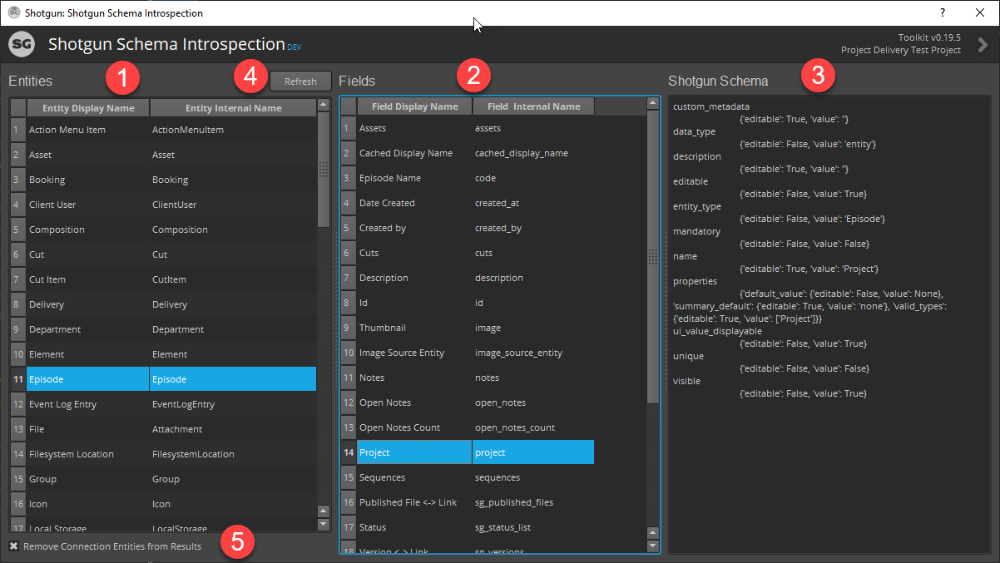

# Shotgun Schema Introspection Toolkit App

##### This is a simple Toolkit app that allows Shotgun and Toolkit developers to quickly navigate and inspect the Shotgun entities, fields and the underlying schema.
##### I've had this in my toolbox for years and thought it might be useful to others.
***
##### Step 1 - Select the Entity your are interested in inspecting
##### Step 2 - Select the Field your are interested in inspecting
##### Step 3 - View the underlying schema of the field
##### Step 4 - If there is a schema change hit refresh to get the latest
##### Step 5 - By default, all "Connection" entities will be filtered from the results. Uncheck to display them

***
##### Feel free to reach out to me with any questions or ideas.

##### Cheers,
##### Scott Ballard
* scott@scottballard.net
* https://www.linkedin.com/in/scottballard/
***
## Installation
Add the app to your TK config along with the following file to your config/env/includes/settings directory
##### sb-shotgun-schema-introspection.yml
 
    settings.sb-shotgun-schema-introspection:
        menu_name: Schema Introspection
        location: '@apps.tk-shotgun-schema-introspection.location'
